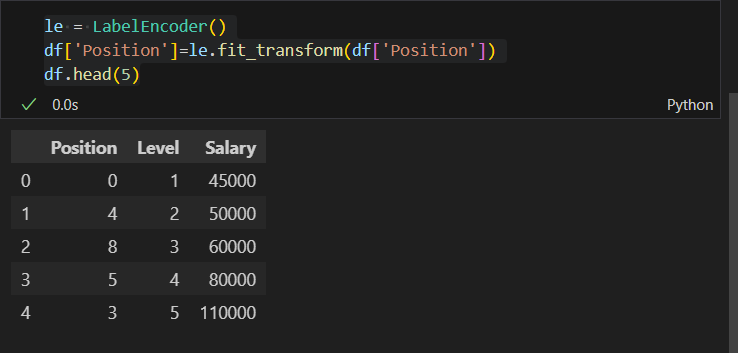

# Implementation-of-Decision-Tree-Regressor-Model-for-Predicting-the-Salary-of-the-Employee

## AIM:
To write a program to implement the Decision Tree Regressor Model for Predicting the Salary of the Employee.

## Equipments Required:
1. Hardware – PCs
2. Anaconda – Python 3.7 Installation / Jupyter notebook

## Algorithm
1. Importing necessary liberaries
2. Data reading and cleaning
3. Splitting data into training and testing
4. Importing Decision-Tree-Regressor-Model

## Program:
```
/*
Program to implement the Decision Tree Regressor Model for Predicting the Salary of the Employee.
Developed by: Nemaleshwar H
RegisterNumber: 212223230142
*/
```
# Importing Necessary Liberaries
```py
import pandas as pd
from sklearn.preprocessing import LabelEncoder
from sklearn.model_selection import train_test_split
from sklearn.tree import DecisionTreeRegressor
from sklearn.metrics import mean_squared_error ,r2_score
```
# Data Reading
```py
df = pd.read_csv("Salary (2).csv")
df.info()
```
# Data Cleaning
```py
le = LabelEncoder()
df['Position']=le.fit_transform(df['Position'])
df.head(5)
```
# Splitting data 
```py
x = df[['Position','Level']]
y= df['Salary']
x_train,x_test,y_train,y_test= train_test_split(x,y,test_size=0.2,random_state=2)
```
# DecisionTreeRegressor
```py
dt = DecisionTreeRegressor()
dt.fit(x_train,y_train)
y_pred= dt.predict(x_test)
```
# mean Squared error
```py
mse = mean_squared_error(y_test,y_pred)
print("Mean Squared error:",mse)
```
# r2_score
```py
r2 = r2_score(y_test,y_pred)
print("root squarared error:",r2)
```
# Prediction
```py
dt.predict([[5,6]])
```

## Output:




## Result:
Thus the program to implement the Decision Tree Regressor Model for Predicting the Salary of the Employee is written and verified using python programming.
